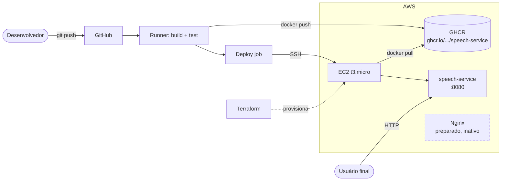

# DevSpeak AI

> Plataforma com IA para ajudar desenvolvedores a se prepararem para entrevistas técnicas internacionais em inglês.


---

## Sobre o projeto

O **DevSpeak AI** combina dois objetivos:

1. **Produto** — uma plataforma de simulação de entrevistas técnicas em inglês com correção assistida por IA, voltada para programadores que buscam vagas internacionais.
2. **Engenharia** — uma arquitetura DevOps de referência, construída com práticas que empresas usam em produção: microsserviços em Go, containers, infraestrutura como código, orquestração com Kubernetes, pipelines CI/CD e observabilidade.

O repositório evolui em fases: cada serviço, peça de infra e automação é adicionado de forma incremental, refletindo um fluxo real de engenharia cloud-native.

---

## Arquitetura



**URL pública atual:** http://13.220.172.249:8080/health
**Imagem no GHCR:** `ghcr.io/dudainfinity/devspeak-speech-service:latest`

> Nginx + Let's Encrypt já estão configurados em `infra/nginx/devspeak.conf` e `infra/scripts/setup-nginx-https.sh`. A ativação está suspensa até registrar um domínio próprio — ver seção [HTTPS](#https-com-nginx-e-lets-encrypt).

Infraestrutura provisionada via **Terraform** (EC2 + Security Group + Key Pair).
Manifests **Kubernetes** existem para execução local em Minikube; migração para EKS está no roadmap.

> Diagramas completos (visão de sistema, topologia de deploy, sequência do CI/CD e decisões de arquitetura) em [`docs/architecture.md`](docs/architecture.md).

---

## Stack tecnológica

| Camada            | Tecnologia                                    |
|-------------------|-----------------------------------------------|
| Linguagem         | Go 1.24                                       |
| Containerização   | Docker, Docker Compose                        |
| Orquestração      | Kubernetes (Minikube — local)                 |
| Cloud             | AWS EC2 (`t3.micro`, Amazon Linux)            |
| IaC               | Terraform                                     |
| Reverse proxy     | Nginx + Let's Encrypt (HTTPS via sslip.io)    |
| Container Registry| GitHub Container Registry (GHCR)              |
| CI/CD             | GitHub Actions                                |
| Observabilidade   | Prometheus, Grafana (local)                   |
| Versionamento     | Git + GitHub                                  |

---

## Estrutura do repositório

```
devspeak-ai/
├── speech-service/          # microsserviço Go (endpoint /health, /metrics)
│   ├── main.go
│   ├── go.mod
│   └── Dockerfile
├── api/                     # backend principal (planejado)
├── frontend/                # interface do usuário (planejado)
├── infra/
│   ├── main.tf              # Terraform: EC2 + Security Group
│   ├── terraform/           # módulos auxiliares
│   ├── nginx/
│   │   └── devspeak.conf    # config Nginx (HTTPS + reverse proxy)
│   ├── scripts/
│   │   └── setup-nginx-https.sh   # bootstrap idempotente do TLS
│   └── k8s/                 # manifests Kubernetes
│       ├── speech-deployment.yaml
│       └── speech-service.yaml
├── docs/                    # documentação adicional
├── .github/workflows/
│   ├── ci.yml               # build + lint a cada push
│   └── deploy.yml           # deploy automático para EC2 via SSH
├── docker-compose.yml       # ambiente local (speech-service + postgres)
└── README.md
```

---

## Rodando localmente

Pré-requisitos: Docker e Docker Compose v2.

```bash
git clone https://github.com/Dudainfinity/devspeak-ai.git
cd devspeak-ai
docker compose up -d --build
```

Verificação:

```bash
curl http://localhost:8080/health
# DevSpeak AI Speech Service Running
```

### Apenas o serviço Go (sem compose)

```bash
cd speech-service
docker build -t speech-service .
docker run -d -p 8080:8080 --name speech-service speech-service
```

---

## Deploy automatizado (CI/CD)

A cada `git push` na branch `main`, um workflow único (`.github/workflows/cicd.yml`) executa dois jobs em sequência:

| Job            | O que faz                                                                                |
|----------------|------------------------------------------------------------------------------------------|
| **build**      | `go build` + multi-stage Docker build + `docker push` no GHCR com tags `latest` e `main-<sha>` |
| **deploy**     | SSH na EC2, `docker pull` da imagem nova do GHCR, restart do container                   |

O job `deploy` depende de `build` (`needs: build`), então só roda se a imagem foi publicada com sucesso — eliminando race condition entre publicação e deploy.

### Estratégia de imagens

| Tag                  | Quando é gerada                | Uso                                     |
|----------------------|--------------------------------|-----------------------------------------|
| `latest`             | a cada push na `main`          | deploy automático                       |
| `main-<sha7>`        | a cada push na `main`          | rollback / auditoria — versão imutável  |

**Rollback** vira `docker run ghcr.io/dudainfinity/devspeak-speech-service:main-<sha-antigo>`.

### Rodar a imagem do GHCR localmente

```bash
docker pull ghcr.io/dudainfinity/devspeak-speech-service:latest
docker run -d -p 8080:8080 ghcr.io/dudainfinity/devspeak-speech-service:latest
```

### Secrets necessários

Configurados em **Settings → Secrets and variables → Actions** do repositório:

| Secret      | Conteúdo                                                                 |
|-------------|--------------------------------------------------------------------------|
| `EC2_HOST`  | IP público da instância EC2                                              |
| `EC2_USER`  | usuário SSH (`ec2-user` para Amazon Linux)                               |
| `EC2_KEY`   | conteúdo completo da chave privada `.pem` (incluindo `BEGIN/END`)        |

> Para evitar problemas de quebra de linha ao colar a chave no navegador, use a CLI: `gh secret set EC2_KEY < ~/.ssh/devspeak-key.pem`

### Setup inicial da EC2 (uma única vez)

```bash
ssh -i ~/.ssh/devspeak-key.pem ec2-user@<EC2_HOST>
sudo yum install -y git docker
sudo systemctl enable --now docker
sudo usermod -aG docker $USER   # reabra a sessão SSH
cd ~ && git clone https://github.com/Dudainfinity/devspeak-ai.git
```

A partir daí, todo `git push` na `main` atualiza a aplicação online automaticamente.

### HTTPS com Nginx e Let's Encrypt

Configuração **pronta no repositório**, ativação pendente até registrar um domínio próprio.

**Quando o domínio estiver pronto** (registrado e com registro A apontando para a EC2):

1. Editar `infra/nginx/devspeak.conf` — substituir os 3 ocorrências de `13-220-172-249.sslip.io` pelo domínio real.
2. Editar `infra/scripts/setup-nginx-https.sh` — substituir `DOMAIN=` pelo domínio real.
3. Commit + push.
4. Na EC2:

```bash
cd ~/devspeak-ai
git pull origin main
bash infra/scripts/setup-nginx-https.sh
```

5. Editar `.github/workflows/deploy.yml` — trocar `-p 8080:8080` por `-p 127.0.0.1:8080:8080` (bloqueia acesso direto ao container, só Nginx passa).

O script `setup-nginx-https.sh` é **idempotente** — ele:

1. Instala `nginx` e `certbot` (skip se já instalado)
2. Sobe Nginx com config HTTP mínima para o desafio ACME
3. Solicita o certificado ao Let's Encrypt via webroot
4. Substitui pela config completa (HTTPS + reverse proxy + headers de segurança)
5. Agenda renovação automática diária às 03:00

> **Sobre as tentativas com sslip.io**: foi tentado como solução zero-config, mas o domínio `sslip.io` está saturado no rate limit semanal do Let's Encrypt (50 certificados/semana por *registered domain*, compartilhado entre milhares de usuários do serviço). Por isso, um domínio próprio é o caminho recomendado.

---

## Provisionando a infraestrutura

```bash
cd infra
terraform init
terraform plan
terraform apply
```

Recursos criados:

- Instância EC2 `t3.micro`
- Security Group com porta `22` (SSH) e `8080` (aplicação)
- Output com o IP público da máquina

---

## Observabilidade

O serviço Go expõe métricas no padrão Prometheus:

```bash
curl http://<EC2_HOST>:8080/metrics
```

Dashboards Grafana foram configurados em ambiente local conectando a um Prometheus que coleta métricas do container. A pilha completa em produção está no roadmap.

---

## Roadmap

**Infra & DevOps**
- [ ] Nginx como reverse proxy na EC2
- [ ] Domínio próprio + certificado HTTPS (Let's Encrypt)
- [ ] Publicação de imagens no GHCR ou Docker Hub
- [ ] Ambientes separados (staging / production)
- [ ] Rollback automatizado no pipeline
- [ ] Migração de Kubernetes local para EKS
- [ ] Monitoramento contínuo da EC2 (CloudWatch + alertas)

**Produto**
- [ ] Frontend inicial (web)
- [ ] API principal com autenticação de usuários
- [ ] Integração com OpenAI para geração e correção de respostas
- [ ] Transcrição de áudio (speech-to-text)
- [ ] Simulador completo de entrevistas técnicas
- [ ] Dashboard do candidato com histórico e métricas de evolução

---

## Licença

A definir.
