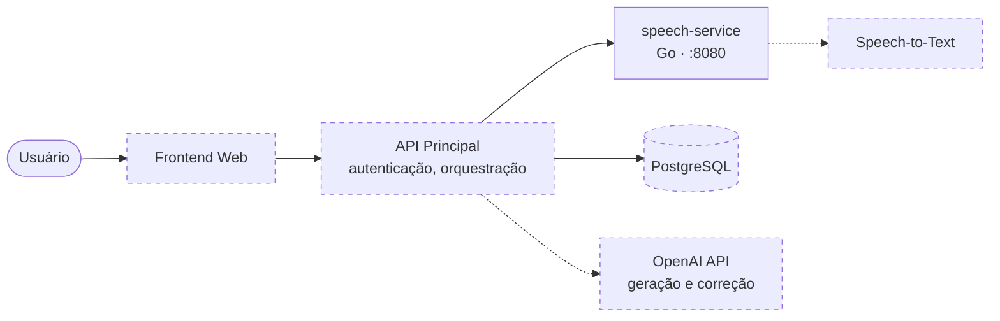
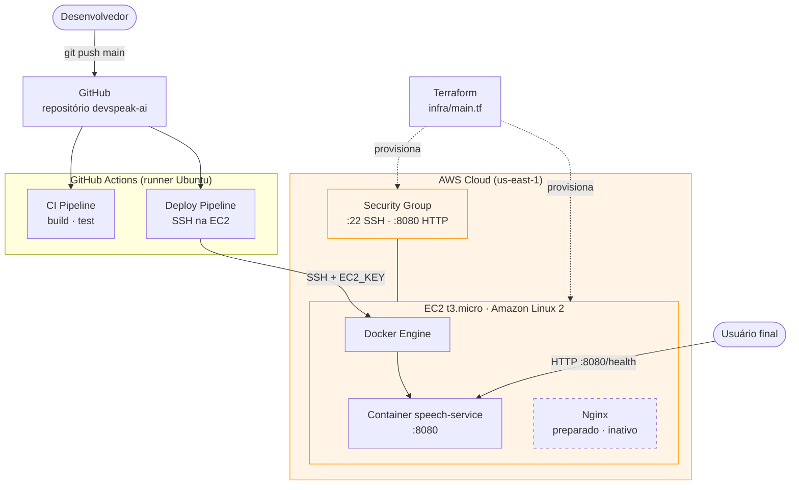
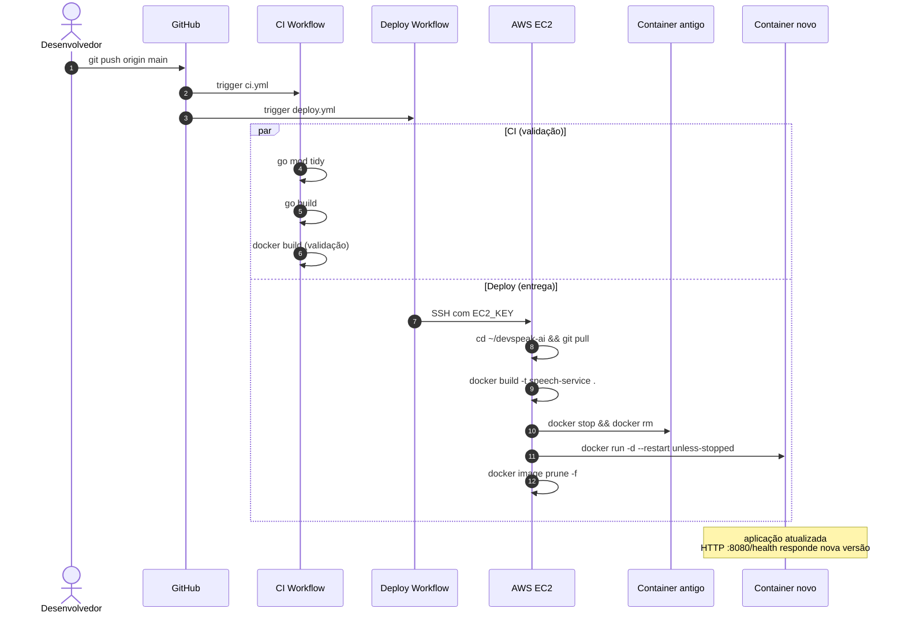
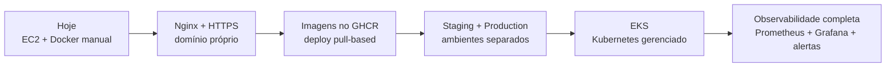

# Arquitetura do DevSpeak AI

Este documento descreve a arquitetura do projeto em três níveis: visão de sistema, topologia de deploy e fluxo de CI/CD. Os diagramas são escritos em [Mermaid](https://mermaid.js.org/) e renderizados nativamente pelo GitHub.

Componentes com **traço cheio** já estão implementados; componentes com **traço pontilhado** estão no roadmap.

---

## 1. Visão de sistema

Componentes lógicos da aplicação e o fluxo de dados entre eles.

**Estado atual:** apenas o `speech-service` está implementado, expondo `/health` e `/metrics`. Os demais componentes estão no roadmap e serão adicionados em fases.

---

## 2. Topologia de deploy

Onde cada coisa roda fisicamente e como a infra é provisionada.

**Componentes provisionados via Terraform:** EC2, Security Group e Key Pair.
**Componentes configurados manualmente uma única vez na EC2:** Docker Engine, clone inicial do repositório.

---

## 3. Fluxo do CI/CD

Sequência de eventos entre o `git push` e o container atualizado em produção.

**Tempo médio de deploy:** ~5 segundos quando o build do Docker está em cache (Go binário não mudou) e até ~1 minuto em rebuilds completos.

---

## Decisões de arquitetura

### Por que Go no `speech-service`?

- Binário único, sem runtime — imagens Docker pequenas e startup rápido.
- Ergonomia natural para HTTP, métricas e concorrência.
- Alinhado com o stack típico de plataformas cloud-native (Docker, Kubernetes, Prometheus — todos escritos em Go).

### Por que `docker run` em vez de `docker compose` na EC2?

- O `speech-service` é hoje a única peça em produção; PostgreSQL ainda não é necessário no ambiente live.
- `docker compose` é usado no ambiente local (`docker-compose.yml`) para desenvolver com banco.
- Quando a API principal entrar em produção, a topologia migra para `docker compose` ou Kubernetes — o que vier primeiro.

### Por que Terraform + Kubernetes local?

- **Terraform** garante que a infra é reproduzível: posso destruir e recriar a EC2 com um comando.
- **Kubernetes local (Minikube)** permite validar manifests (`Deployment`, `Service`, `replicas`) antes da migração para EKS, sem custo de cloud durante o aprendizado.

### Por que Nginx na frente do container?

- **TLS termination**: o Go service só fala HTTP em `127.0.0.1:8080`; Nginx cuida de HTTPS, certificados e renovação automática.
- **Headers de segurança**: HSTS, `X-Content-Type-Options`, `X-Frame-Options`, `Referrer-Policy` configurados em um único ponto.
- **Container exposto apenas em `127.0.0.1`**: defense-in-depth — mesmo que a porta 8080 esteja aberta no Security Group, o container só aceita conexões do próprio host (do Nginx). O mundo externo não consegue contornar o reverse proxy.
- **Compressão (gzip) e ponto futuro para cache**: tarefas que não pertencem ao código de aplicação.

### Por que sslip.io em vez de domínio próprio?

- Permite HTTPS real (Let's Encrypt) sem registrar domínio — ideal para validar a stack rapidamente.
- A migração para um domínio próprio é mecânica: alterar `server_name` em `infra/nginx/devspeak.conf`, repetir `setup-nginx-https.sh`, apontar registro A do domínio para o IP da EC2.

### Por que SSH no deploy em vez de pull-based?

- Modelo push-based via SSH é mais simples para um único host e demonstra controle direto sobre a infra.
- Quando houver mais de um nó, a topologia migra para pull-based: imagem publicada no GHCR + agente na EC2 que monitora a tag (ou Kubernetes fazendo o pull).

---

## Roadmap de evolução arquitetural

Cada passo é descrito como um item do roadmap no `README.md`.
